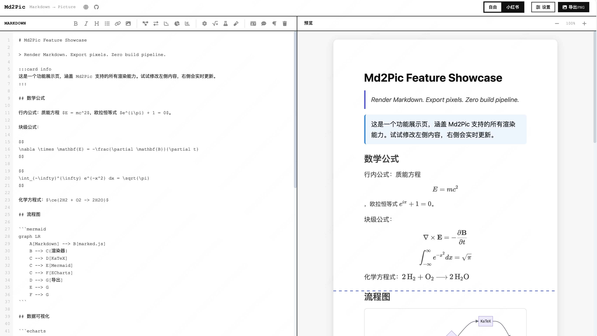
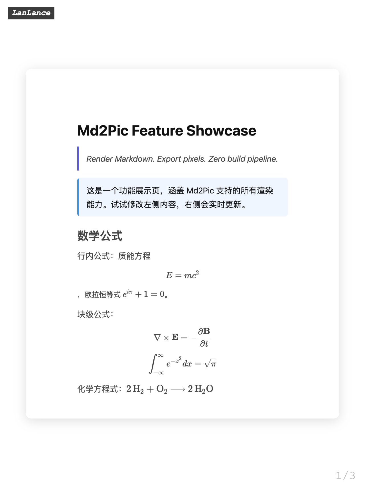
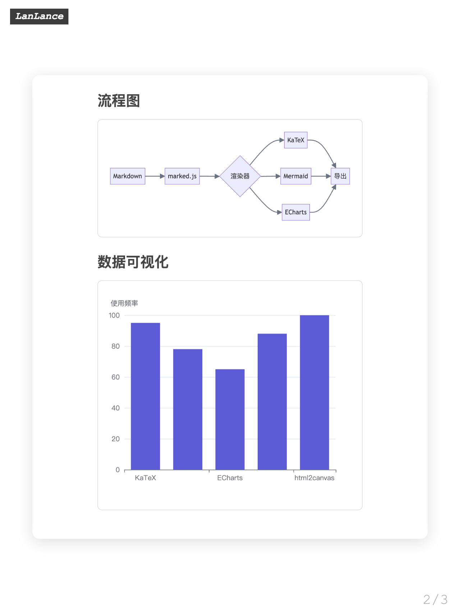
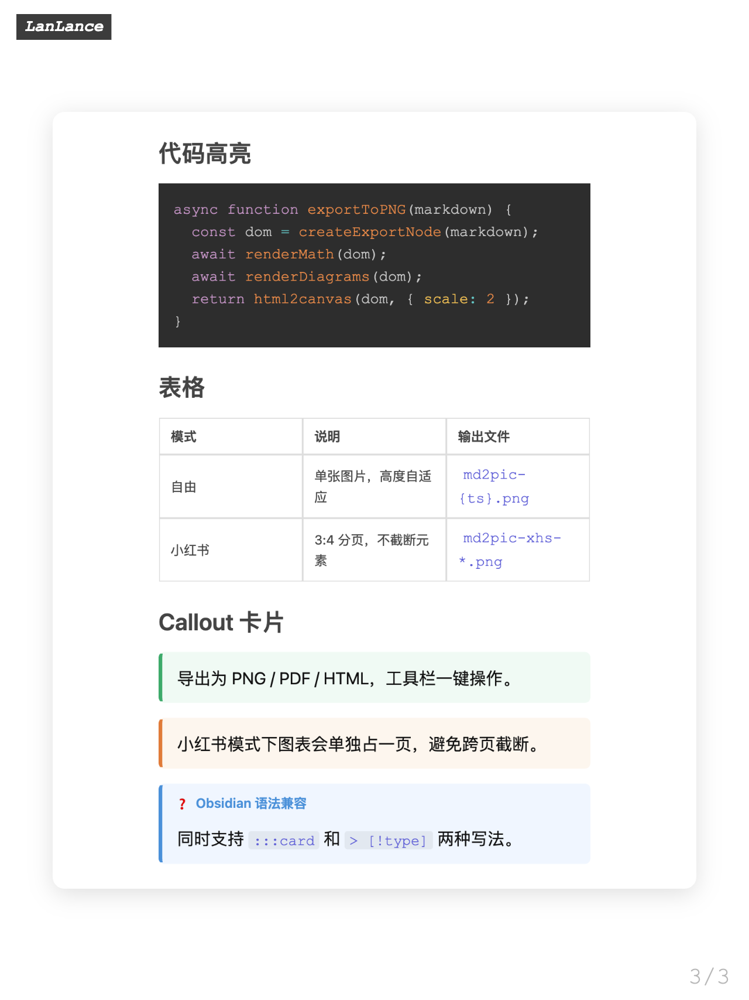
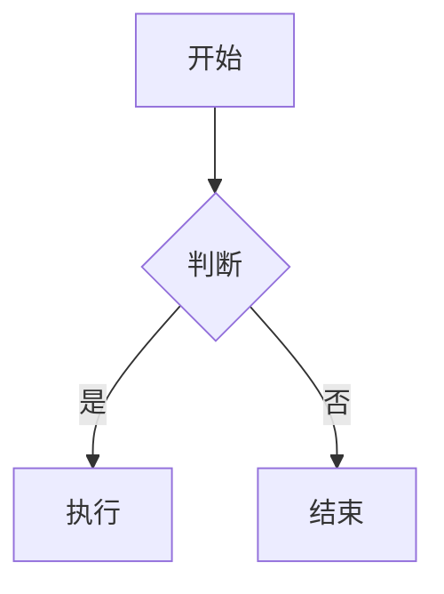

<p align="center">
  
</p>

<h1 align="center">Md2Pic</h1>

<p align="center">
  Render Markdown. Export pixels. Zero build pipeline.
</p>

<p align="center">
  <a href="https://github.com/LgoLgo/md2pic/actions"></a>
  <a href="https://github.com/LgoLgo/md2pic/blob/main/LICENSE"></a>
  
  
</p>

<p align="center">
  <a href="https://lgolgo.github.io/md2pic">在线使用</a> ·
  <a href="#cli">CLI</a> ·
  <a href="CHANGELOG.md">更新日志</a>
</p>

---

## 简介

Md2Pic 是一个运行在浏览器端的 Markdown 可视化导出工具。输入 Markdown，实时预览渲染结果，支持一键导出为 PNG / PDF / HTML。

内置 KaTeX 数学公式、Mermaid 图表、ECharts 数据可视化和 Callout 卡片渲染能力。提供自由导出和小红书 3:4 分页两种模式，分页时保证元素完整性，不做跨页截断。

全部逻辑在客户端完成，无服务端依赖。所有第三方库通过 CDN 按需加载，项目本身不依赖任何构建工具链。

### 预览

<p align="center">
  
</p>

#### 小红书模式导出

<p align="center">
  &nbsp;
  &nbsp;
  
</p>

## 快速开始

### 在线访问

**https://lgolgo.github.io/md2pic**

### 本地运行

```bash
git clone https://github.com/LgoLgo/md2pic.git
cd md2pic
npm start
# → http://localhost:8080
```

`npm start` 启动静态文件服务器，不涉及编译或打包流程。

### 自部署

将以下文件部署至任意静态托管服务（Nginx / Vercel / Cloudflare Pages 等）：

```
index.html  script.js  style.css  favicon.svg  manifest.json
```

无需构建步骤。

## CLI

基于 Puppeteer 的命令行导出工具，支持无头模式和批量处理：

```bash
# 安装
npm install          # 安装 puppeteer 依赖
npm install -g .     # 全局注册 md2pic 命令

# 自由模式 → 单张 PNG
md2pic input.md output.png
md2pic input.md                      # 自动生成文件名

# 小红书模式 → 3:4 多页 PNG
md2pic input.md ./out --xhs
md2pic input.md --xhs                # 输出至当前目录

# 查看帮助
md2pic --help
```

工作原理：启动无头 Chrome → 加载本地 `index.html` → 注入 Markdown 内容 → 截图导出。全程离线，不依赖网络。

## 语法参考

### 数学公式

行内公式 `$...$`，块级公式 `$$...$$`，渲染引擎为 [KaTeX](https://katex.org/)，语法兼容 LaTeX：

```markdown
欧拉恒等式：$e^{i\pi} + 1 = 0$

$$
\int_a^b f(x)\,dx = F(b) - F(a)
$$
```

化学方程式通过 mhchem 扩展支持，首次使用时自动加载：

```markdown
$\ce{2H2 + O2 -> 2H2O}$
```

### 图表

````markdown

````

支持流程图、序列图、甘特图、饼图等，完整语法参见 [mermaid.js.org](https://mermaid.js.org/)。

### 数据可视化

````markdown
```echarts
{
  "xAxis": { "type": "category", "data": ["Q1", "Q2", "Q3"] },
  "yAxis": { "type": "value" },
  "series": [{ "type": "bar", "data": [120, 200, 150] }]
}
```
````

接受任意合法的 [ECharts option](https://echarts.apache.org/zh/option.html) JSON 配置。

### Callout 卡片

```markdown
:::card info
提示信息
:::

:::card warning
警告内容
:::

:::card success
操作成功
:::

:::card error
发生错误
:::
```

兼容 Obsidian Callout 语法：

```markdown
> [!note] 标题
> 正文内容
```

## 导出模式

| 模式 | 说明 | 输出 |
|------|------|------|
| 自由 | 单张图片，高度自适应内容 | `md2pic-{timestamp}.png` |
| 小红书 | 3:4 比例分页，元素不跨页截断 | `md2pic-xhs-1.png`、`md2pic-xhs-2.png`... |

通过工具栏切换模式，布局面板可调整内容宽度、边距和字号。

## 架构

```
Markdown
  → marked.js
HTML
  → KaTeX        数学公式
  → Mermaid      图表
  → ECharts      数据可视化
  → CardRenderer 卡片
DOM
  → html2canvas  → PNG
  → jsPDF        → PDF
```

核心设计：

- 渲染管线串行执行，确保各渲染器之间无竞态
- 导出时创建隔离 DOM 节点（`#md2pic-export-poster`），不影响实时预览
- 多尺度降级策略（scale 2 → 1.5 → 1.25 → 1），兼容大尺寸内容
- 外部图片跨域加载失败时自动通过 weserv.nl 代理重试

## 技术栈

| | |
|---|---|
| 核心 | 原生 HTML / CSS / JS |
| Markdown | [marked.js](https://marked.js.org/) |
| 公式 | [KaTeX](https://katex.org/) + mhchem |
| 图表 | [Mermaid.js](https://mermaid.js.org/) · [ECharts](https://echarts.apache.org/) |
| 语法高亮 | [Prism.js](https://prismjs.com/) |
| 导出 | [html2canvas](https://html2canvas.hertzen.com/) · [jsPDF](https://github.com/parallax/jsPDF) |
| CLI | Node.js · [Puppeteer](https://pptr.dev/) |

## 参与贡献

1. Fork → 新分支 → 提交 → PR
2. 保持原生实现，不引入构建工具和前端框架
3. 提交前请在自由模式和小红书模式下分别测试导出功能

## 参考

本项目 fork 自 [xiaolinbaba/madopic](https://github.com/xiaolinbaba/madopic)

## 许可证

[Apache-2.0](LICENSE)
