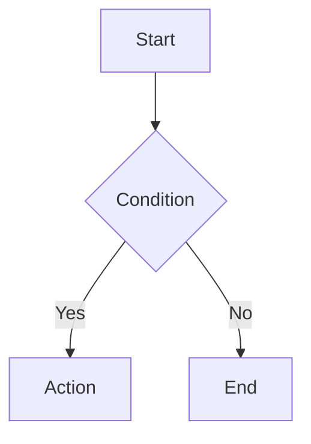

<p align="center">
  
</p>

<h1 align="center">Md2Pic</h1>

<p align="center">
  Markdown → Picture. No server, no build tools, just open and use.
</p>

<p align="center">
  <a href="https://github.com/LgoLgo/md2pic/actions"></a>
  <a href="https://github.com/LgoLgo/md2pic/blob/main/LICENSE"></a>
  
  
</p>

<p align="center">
  <a href="https://lgolgo.github.io/md2pic">Live Demo</a> ·
  <a href="#cli">CLI</a> ·
  <a href="CHANGELOG.md">Changelog</a>
</p>

---

## What is this?

A pure-frontend tool that turns Markdown into high-quality images.
Write Markdown on the left, get a live preview on the right, export to PNG / PDF / HTML in one click.

Supports math (KaTeX), diagrams (Mermaid), charts (ECharts), callout cards, and a Xiaohongshu pagination mode — all running in your browser with zero backend.

## Getting Started

### Use Online

Visit **https://lgolgo.github.io/md2pic** — that's it.

### Run Locally

```bash
git clone https://github.com/LgoLgo/md2pic.git
cd md2pic
npm start
# → http://localhost:8080
```

No `node_modules` drama. `npm start` just fires up a static server. Every dependency loads from CDN at runtime.

### Self-Host

Drop these files on any static hosting (Nginx, Vercel, Cloudflare Pages, etc.):

```
index.html
script.js
style.css
favicon.svg
manifest.json
```

No build step required.

## CLI

For headless / batch export via Puppeteer:

```bash
# Install
npm install          # pulls puppeteer
npm install -g .     # registers `md2pic` globally

# Free mode — single PNG
md2pic input.md output.png
md2pic input.md                      # auto-generates filename

# Xiaohongshu mode — 3:4 paginated PNGs
md2pic input.md ./out --xhs
md2pic input.md --xhs                # outputs to current dir

# Help
md2pic --help
```

The CLI launches headless Chrome, loads the local `index.html`, injects your Markdown, and screenshots. No network needed.

## Syntax Reference

### Math (KaTeX)

Inline math with `$...$`, display math with `$$...$$`:

```markdown
Euler's identity: $e^{i\pi} + 1 = 0$

$$
\int_a^b f(x)\,dx = F(b) - F(a)
$$
```

Chemistry via mhchem (auto-loaded on first use):

```markdown
$\ce{2H2 + O2 -> 2H2O}$
```

### Diagrams (Mermaid)

````markdown

````

Supports flowcharts, sequence diagrams, Gantt charts, pie charts, and more. Full syntax at [mermaid.js.org](https://mermaid.js.org/).

### Charts (ECharts)

````markdown
```echarts
{
  "xAxis": { "type": "category", "data": ["Mon", "Tue", "Wed"] },
  "yAxis": { "type": "value" },
  "series": [{ "type": "bar", "data": [120, 200, 150] }]
}
```
````

Accepts any valid [ECharts option](https://echarts.apache.org/en/option.html) as JSON.

### Callout Cards

```markdown
:::card info
This is an info card.
:::

:::card warning
Watch out!
:::

:::card success
All good.
:::

:::card error
Something went wrong.
:::
```

Also supports Obsidian-style callouts:

```markdown
> [!note] Title
> Content goes here.
```

## Export Modes

| Mode | Behavior | Output |
|------|----------|--------|
| Free | Single image, height matches content | `md2pic-{timestamp}.png` |
| Xiaohongshu | 3:4 paginated, elements never split across pages | `md2pic-xhs-1.png`, `md2pic-xhs-2.png`, ... |

Switch between modes using the toggle in the toolbar. Layout settings (width, padding, font size) are adjustable via the layout panel.

## Architecture

```
Markdown input
  → marked.js parse
HTML
  → KaTeX      (math)
  → Mermaid    (diagrams)
  → ECharts    (charts)
  → CardRenderer (callouts)
Rendered DOM
  → html2canvas (PNG) / jsPDF (PDF)
Export
```

Key design decisions:

- **Async serial pipeline** — renderers execute in sequence to avoid race conditions
- **Isolated export DOM** — export creates a cloned `#md2pic-export-poster` node so the live preview is never affected
- **Multi-scale fallback** — tries scale 2 → 1.5 → 1.25 → 1 to handle large content gracefully
- **CORS proxy** — images that fail crossorigin checks are retried through weserv.nl

## Tech Stack

| Layer | Tech |
|-------|------|
| Core | Vanilla HTML / CSS / JS |
| Markdown | [marked.js](https://marked.js.org/) |
| Math | [KaTeX](https://katex.org/) + mhchem |
| Diagrams | [Mermaid.js](https://mermaid.js.org/) |
| Charts | [Apache ECharts](https://echarts.apache.org/) |
| Syntax Highlight | [Prism.js](https://prismjs.com/) |
| Export | [html2canvas](https://html2canvas.hertzen.com/) + [jsPDF](https://github.com/parallax/jsPDF) |
| CLI | Node.js + [Puppeteer](https://pptr.dev/) |

## Contributing

1. Fork → branch → commit → PR
2. Keep it vanilla — no bundlers, no frameworks
3. Test export in both Free and Xiaohongshu modes before submitting

## License

[Apache-2.0](LICENSE)
