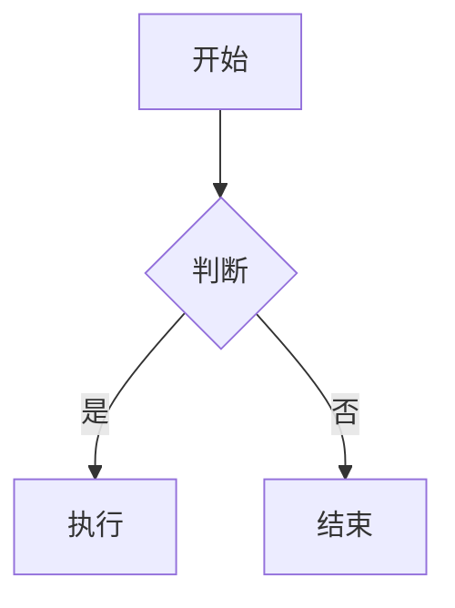

# Md2Pic

纯前端 Markdown 转图片工具，支持数学公式、图表、多格式导出。

## Features

- **Markdown → PNG/PDF/HTML**：一键导出高质量文件
- **数学公式**：KaTeX 渲染，支持行内 `$...$` 和块级 `$$...$$`，mhchem 化学公式扩展
- **流程图**：Mermaid 集成，支持流程图、序列图、甘特图、饼图
- **数据图表**：ECharts 可视化，柱状图、折线图、饼图
- **Callout 卡片**：`:::card [type]` 语法 + Obsidian `> [!note]` 语法
- **两种导出模式**：自由模式（单张完整图）、小红书模式（3:4 多页分页，元素完整不截断）
- **CLI 工具**：`md2pic` 命令行，Puppeteer 驱动
- **零构建工具**：原生 HTML/CSS/JS，所有依赖通过 CDN 加载

## Quick Start

```bash
npm start
# 浏览器访问 http://localhost:8080
```

## CLI

需要 Node.js + npm，首次安装：

```bash
npm install        # 安装 puppeteer 依赖
npm install -g .   # 全局注册 md2pic 命令
```

```bash
# 自由模式：输出单张 PNG
md2pic input.md output.png

# 自由模式：不指定输出文件名（自动生成）
md2pic input.md

# 小红书模式：输出多张 PNG 到指定目录
md2pic input.md ./out --xhs

# 小红书模式：输出到当前目录
md2pic input.md --xhs

# 查看帮助
md2pic --help
```

CLI 工作原理：Puppeteer 启动无头 Chrome，加载本地 `index.html`，注入 Markdown 内容后截图导出，无需网络连接。

## Usage

### 数学公式

```markdown
行内：$E=mc^2$

块级：
$$
\int_a^b f(x)dx = F(b) - F(a)
$$

化学：$\ce{H2O}$、$\ce{CO2 + C -> 2CO}$
```

### Callout 卡片

```markdown
:::card info
这是提示信息
:::

:::card warning
警告内容
:::

:::card success
成功提示
:::

:::card error
错误信息
:::
```

也支持 Obsidian 语法：

```markdown
> [!note] 标题
> 内容
```

### 流程图

````markdown

````

### 数据图表

````markdown
```echarts
{
  "xAxis": { "type": "category", "data": ["A", "B", "C"] },
  "yAxis": { "type": "value" },
  "series": [{ "type": "bar", "data": [10, 20, 30] }]
}
```
````

## Export Modes

| 模式 | 说明 | 文件名 |
|------|------|--------|
| 自由 | 内容多高图就多高，单张完整图 | `md2pic-{timestamp}.png` |
| 小红书 | 3:4 比例多页分页，每个元素保证完整不截断 | `md2pic-xhs-1.png`、`md2pic-xhs-2.png`... |

## Architecture

**渲染管线**（异步串行）：

```
Markdown 输入 → marked.js 解析 → HTML 输出
  ↓ KaTeX 渲染数学公式
  ↓ Mermaid 渲染流程图
  ↓ ECharts 渲染数据图表
  ↓ CardRenderer 渲染 Callout
  ↓ html2canvas / jsPDF 导出
```

**核心模块**：
- `MathRenderer`：KaTeX 数学公式渲染
- `DiagramRenderer`：Mermaid 图表渲染
- `EChartsRenderer`：ECharts 数据可视化
- `CardRenderer`：Callout 卡片渲染

详见 [CLAUDE.md](CLAUDE.md)

## Tech Stack

- **核心**：原生 HTML/CSS/JavaScript
- **Markdown 解析**：marked.js
- **数学公式**：KaTeX + mhchem
- **图表**：Mermaid.js + Apache ECharts
- **导出**：html2canvas（PNG）、jsPDF（PDF）
- **CLI**：Node.js + Puppeteer

## License

Apache 2.0
